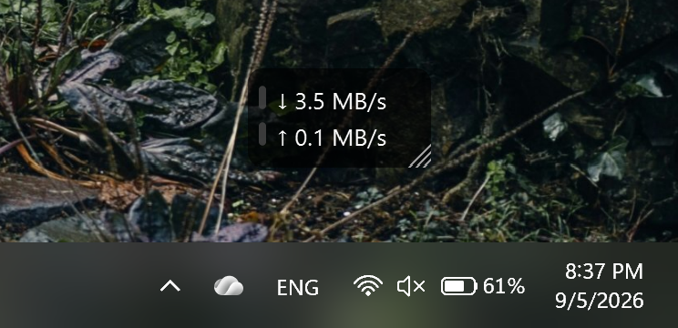
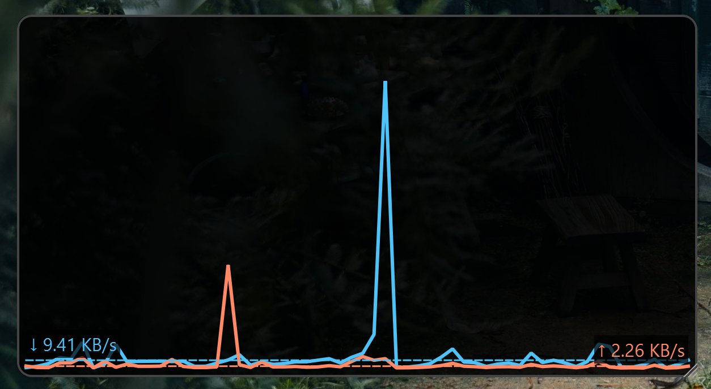
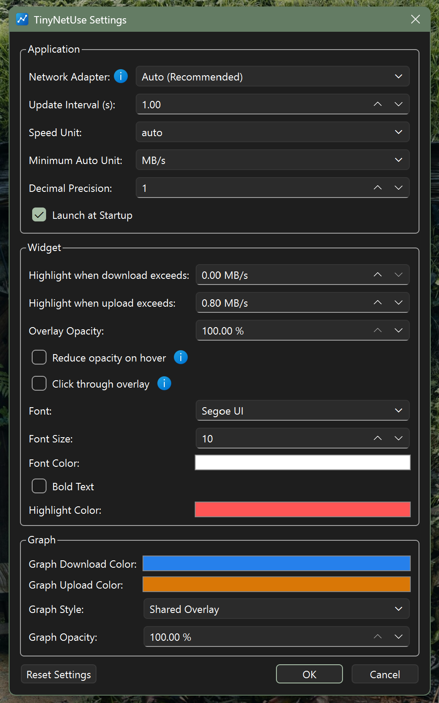

<picture>
  <source media="(prefers-color-scheme: dark)" srcset="docs/TinyNetUse-horizontal-light.png">
  
</picture>

# TinyNetUse

TinyNetUse is a small open-source Windows utility that shows current download and upload speeds in a movable desktop overlay, with an optional history graph.

  

<!-- TODO: Add a short gif demonstration here later.

  

-->

## Download

TinyNetUse is currently verified on 64-bit Windows 11. Other Windows versions have not yet been verified.

[Download the latest TinyNetUse release](https://github.com/laween-alsulaivany/TinyNetUse/releases/latest)

For most users, choose **`TinyNetUse-Setup-<version>.exe`**. The installer sets up TinyNetUse for your Windows account and does not require administrator access.

The portable download runs without installation. Keep `portable.flag` beside `TinyNetUse.exe` so its settings stay in the same folder.

Neither download requires Python.

TinyNetUse is applying to use SignPath Foundation for code signing of official Windows releases. See the [Code signing policy](#code-signing-policy) for details.

Current release builds are not yet code-signed, so Windows SmartScreen may show a warning when you first run them.

## Features

- Live download and upload speeds with automatic or fixed units
- Automatic active-connection monitoring or a specific network adapter
- Optional rolling network graph
- Movable and resizable overlay with position locking and always-on-top mode
- Configurable font, colors, opacity, precision, update interval, and download/upload highlight thresholds
- System tray controls and an optional launch-at-Windows-startup setting

## Basic usage

1. Install TinyNetUse, or extract the portable files to a folder you can keep.
2. Launch TinyNetUse. The speed overlay appears on the desktop and a TinyNetUse icon appears in the system tray.
3. Right-click the overlay or tray icon for graph controls, overlay options, Settings, window-position recovery, About, and Quit.
4. Drag the overlay to move it. Drag its bottom-right corner to resize it.

Your settings and window positions are saved automatically.

## Screenshots

The graph displays recent download and upload activity using the same units as the overlay.

  

The settings window groups Application, Widget, and Graph controls for monitoring, appearance, alerts, and startup behavior.

  

## Privacy and network behavior

TinyNetUse reads the network byte counters provided by Windows to calculate current speeds. It does not inspect packet contents, send telemetry, or collect usage data. Project and release links open GitHub in your default browser only when you select them.

In Auto mode, TinyNetUse asks Windows which adapter owns the best network route. This is a local route lookup and does not send a packet. If Windows cannot provide a matching adapter, TinyNetUse totals all active adapters that have a usable non-loopback IP address. This fallback can include physical, VPN, and virtual adapters, so layered traffic may be counted more than once. TinyNetUse is not an exact ISP bandwidth accounting tool.

Installed settings are stored locally in `%LOCALAPPDATA%\TinyNetUse\config.json`. Portable settings are stored beside the executable only when `portable.flag` is present.

## Issues and feedback

Report bugs or request changes through [GitHub Issues](https://github.com/laween-alsulaivany/TinyNetUse/issues). Include your TinyNetUse version, Windows version, and the steps that reproduce the problem when possible.

## License

TinyNetUse is open source under the [MIT License](LICENSE).

## Code signing policy

See the [TinyNetUse Code signing policy](CODE_SIGNING_POLICY.md).

Free code signing provided by SignPath.io, certificate by SignPath Foundation.

## Development

Source setup, testing, build, and release instructions are in [DEVELOPMENT.md](DEVELOPMENT.md).
