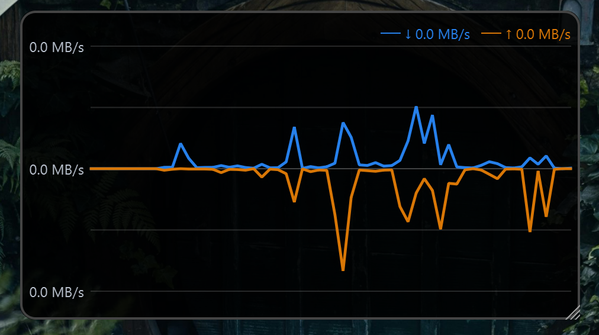
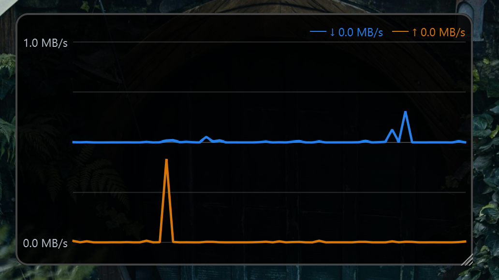
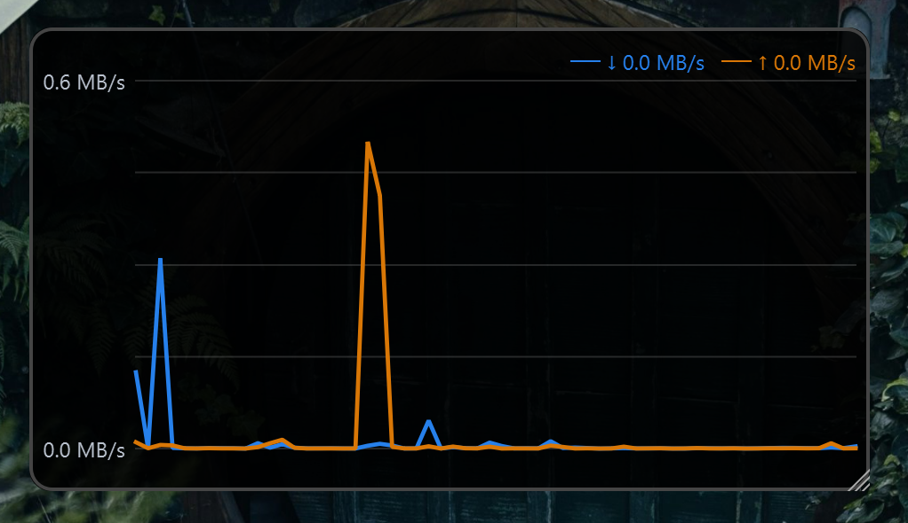

  <picture>
    <source media="(prefers-color-scheme: dark)" srcset="docs/TinyNetUse-horizontal-light.png">
    
  </picture>

# TinyNetUse

TinyNetUse is a small open-source Windows utility that shows current download and upload speeds in a movable desktop overlay, with an optional history graph.

  

## Download

TinyNetUse is currently verified on 64-bit Windows 11. Other Windows versions have not yet been verified.

[Download the latest TinyNetUse release](https://github.com/laween-alsulaivany/TinyNetUse/releases/latest)

For most users, choose **`TinyNetUse-Setup-<version>.exe`**. The installer sets up TinyNetUse for your Windows account without requiring administrator access.

The portable version runs without installation. Keep `portable.flag` beside `TinyNetUse.exe` if you want its settings stored in the same folder.

Neither version requires Python.

TinyNetUse releases are currently unsigned, so Windows SmartScreen may display a warning when installing or running the application. SHA-256 checksums are published with each release.

## Features

* Live download and upload speeds with automatic or fixed display units
* Automatic active-connection monitoring or selection of a specific network adapter
* Optional history graph with Centered, Stacked, and Shared Overlay layouts
* Movable and resizable overlay with position locking, always-on-top, and click-through modes
* Configurable appearance, units, precision, update interval, and speed thresholds
* System tray controls, optional launch at Windows startup, and manual update checks

## Basic usage

1. Install TinyNetUse, or extract the portable version to a folder you can keep.
2. Launch TinyNetUse. The speed overlay appears on the desktop and a TinyNetUse icon appears in the system tray.
3. Right-click the overlay or tray icon to access the graph, settings, overlay options, application information, and quit controls.
4. Drag the overlay to move it. Drag its bottom-right corner to resize it.

Settings and window positions are saved automatically.

## Graph

The optional graph shows recent download and upload activity and supports three display layouts.

### Centered

Downloads and uploads are plotted on opposite sides of a centered zero line.

  

### Stacked

Download and upload activity are shown in separate stacked areas.

  

### Shared Overlay

Download and upload activity are plotted together on the same scale.

  

## Settings

Settings are organized into Application, Widget, and Graph sections.

  

## Privacy and network behavior

TinyNetUse reads network byte counters provided by Windows to calculate current speeds. It does not inspect packet contents, send telemetry, or collect usage data.

Project and release links open GitHub only when selected. Update checks also run only when requested by the user; TinyNetUse does not check for updates automatically.

In Auto mode, TinyNetUse asks Windows which adapter owns the preferred network route. This lookup is performed locally and does not send network traffic. If Windows cannot identify a matching adapter, TinyNetUse falls back to active adapters with usable non-loopback IP addresses.

This fallback can include physical, VPN, and virtual adapters, so traffic may be counted more than once in some network configurations. TinyNetUse is intended as a live network-activity monitor rather than an exact bandwidth-accounting tool.

Installed settings are stored locally in `%LOCALAPPDATA%\TinyNetUse\config.json`. Portable settings are stored beside the executable when `portable.flag` is present.

## Issues and feedback

Report bugs or request changes through [GitHub Issues](https://github.com/laween-alsulaivany/TinyNetUse/issues).

When reporting a problem, include the TinyNetUse version, Windows version, and steps to reproduce the issue when possible.

## License

TinyNetUse is open source under the [MIT License](LICENSE).

## Development

Source setup, testing, build, and release instructions are available in [DEVELOPMENT.md](DEVELOPMENT.md).

Information about official builds and future code signing is available in the [code signing policy](CODE_SIGNING_POLICY.md).
